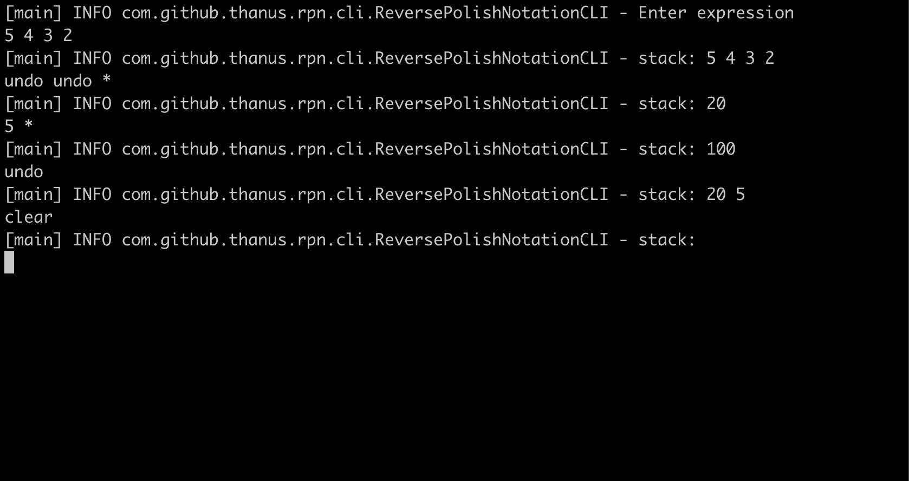

# RPN calculator

A command-line reverse polish notation calculator written in Java. The calculator waits for user input and expects to
receive strings containing whitespace separated lists of numbers and operators. Numbers are pushed on to the stack.
Operators operate on numbers that are on the stack.

The calculator has the following features:
- Available operators are +, -, *, /, sqrt, undo, clear.
  - The ‘clear’ operator removes all items from the stack.
  - The ‘undo’ operator undoes the previous operation. “undo undo” will undo the previous two operations.
  - Sqrt performs a square root on the top item from the stack.
  - The ‘+’, ‘-’, ‘*’, ‘/’ operators perform addition, subtraction, multiplication and division respectively on the top
  two items from the stack.
- If an operator cannot find a sufficient number of parameters on the stack, a warning is displayed:
`operator <operator> (position: <pos>): insufficient parameters`. After displaying the warning, all further processing
of the string terminates and the current state of the stack is displayed.



## Usage

### Building from source

After cloning the project, you can build it from source with:

```shell
./mvnw clean install
```

**Running commandline**

After running the commands below, it will launch the RPN calculator.

```shell
java -jar rpn-cli/target/rpn-cli-1.0-SNAPSHOT-jar-with-dependencies.jar
```
